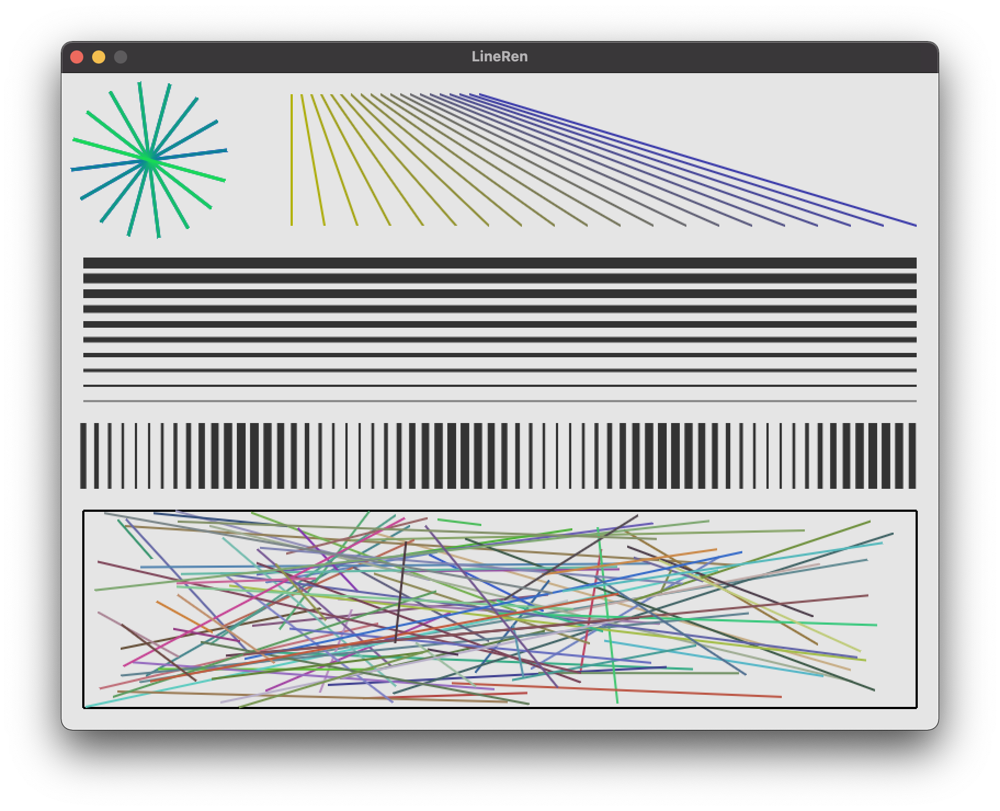

# A simple anti-aliased line rendering example





## Description

This renders perfectly anti-aliased lines on OpenGL ES 2.0 feature level hardware without using MSAA or supersampling. This is done by expanding the line into a quad slightly thicker than the wanted line width and calculating alpha coverage values on the line edges in the fragment shader.

Coverage calculation involves two per-vertex values - signed distance of fragment center from a line side (so one side is positive, one negative), and the desired width. Desired width is constant across all the line fragments and is compared to the signed distance to know which fragments are on the edge and would be only partially covered by the line.

## Compiling

On macOS make sure SDL2 and CMake is installed
`
brew install cmake sdl2
`

Then compile & run like this:
```bash
mkdir build
cd build
cmake ..
make
./linren
```

## TODO

* I'm not 100% sure the coverage calculation is correct. It looks plausible but it needs to be proven.
* No index buffer is used to each line some wasted data being moved around - 6 vertices instead of 4.
* If lines are mostly static and doesn't change every frame then using GPU vertex buffer instead of client-side buffer would increase the performance when drawing many lines.
* High DPI screens are not supported in the demo app so the output looks more pixelated than it should on retina screens.
